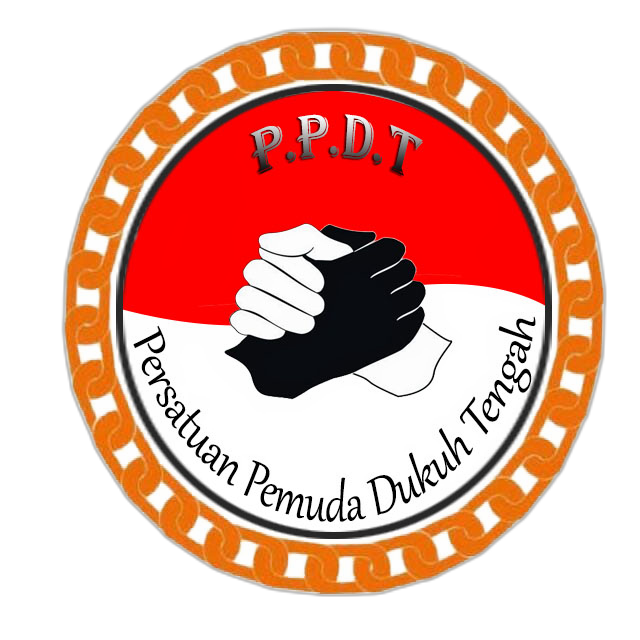

# 🌅 PPDT - Persatuan Pemuda Dukuh Tengah

<div align="center">



**Website resmi & Progressive Web App (PWA) untuk organisasi kepemudaan Persatuan Pemuda Dukuh Tengah**

*"Membangun Kebersamaan, Menjalin Persaudaraan"*

[](https://nextjs.org/)
[](https://www.typescriptlang.org/)
[](https://tailwindcss.com/)
[](https://supabase.com/)
[](https://vercel.com/)
[](https://web.dev/progressive-web-apps/)

</div>

---

## Live Demo

**🚀 Live Demo:** [https://ppdt-website-nine.vercel.app/](https://ppdt-website.vercel.app/)

## 📖 Tentang Proyek

PPDT (Persatuan Pemuda Dukuh Tengah) adalah organisasi kepemudaan yang bergerak di wilayah RT 12, 13, dan 14 Dukuh Tengah. Website ini dibangun sebagai **rumah digital** organisasi untuk:

- 📢 Menyampaikan informasi & pengumuman ke seluruh anggota
- 📅 Mendokumentasikan kegiatan organisasi
- 💰 Memberikan **transparansi keuangan** dengan visualisasi data
- 🏆 Mencatat dan menampilkan pemenang arisan rutin
- 📸 Mengarsipkan momen-momen kebersamaan
- 🌐 Menjadi identitas digital profesional bagi organisasi

## ✨ Fitur Utama

### 🌐 Halaman Publik

| Halaman | Deskripsi |
|---------|-----------|
| **Beranda** | Hero section, statistik real-time, kegiatan terbaru, CTA |
| **Tentang** | Profil organisasi, visi-misi, 6 nilai inti, struktur pengurus |
| **Informasi** | Pengumuman bulanan dengan badge "Terbaru" otomatis |
| **Kegiatan** | List kegiatan dengan filter & detail per acara |
| **Galeri** | Dokumentasi foto kegiatan dengan caption |
| **Arisan** | Daftar pemenang arisan dengan highlight terbaru |
| **Keuangan** | Laporan transparan + grafik tren saldo, pemasukan, dan kategori |

### 🔐 Panel Admin

- 🔑 **Login aman** dengan Supabase Auth (email/password)
- 📊 **Dashboard real-time** dengan analytics & quick actions
- 📝 **CRUD lengkap** untuk:
  - Kegiatan (dengan upload foto header)
  - Galeri (multi-upload sekaligus)
  - Informasi/pengumuman bulanan
  - Pemenang arisan
  - Transaksi keuangan
- 👥 **User Management** (khusus super admin)
- ⚙️ **Pengaturan Organisasi** (data umum, kontak, sosial media)
- 📱 **Mobile-friendly** — bisa update konten dari HP

### 📊 Visualisasi Data Keuangan

- 📈 **Line chart** — tren saldo bulanan dengan area gradient
- 📊 **Bar chart** — perbandingan pemasukan vs pengeluaran
- 🥧 **Pie chart** — distribusi pengeluaran berdasarkan kategori

### 🌙 Dark Mode Permanent

Website didesain dengan **dark mode permanen** menggunakan tema **Sunset Vibrant** yang konsisten di seluruh halaman.

### 📱 Progressive Web App (PWA)

- ✅ **Installable** di Android & iOS — icon di home screen
- ✅ **Offline support** — halaman ter-cache bisa diakses tanpa internet
- ✅ **Standalone mode** — tampil seperti native app (no browser UI)
- ✅ **Splash screen** dengan logo PPDT
- ✅ **App shortcuts** — long-press icon untuk akses cepat (Login Admin, Kegiatan, Keuangan, Galeri)
- ✅ **Smart install banner** — muncul setelah 5 detik di mobile

---

## 🛠️ Tech Stack

### Frontend
- **[Next.js 16](https://nextjs.org/)** — React framework dengan App Router
- **[TypeScript 5](https://www.typescriptlang.org/)** — Type-safe JavaScript
- **[Tailwind CSS v4](https://tailwindcss.com/)** — Utility-first CSS
- **[shadcn/ui](https://ui.shadcn.com/)** — Komponen UI berbasis Radix
- **[Lucide React](https://lucide.dev/)** — Icon library
- **[Recharts](https://recharts.org/)** — Charting library
- **[next-themes](https://github.com/pacocoursey/next-themes)** — Theme management

### Backend & Database
- **[Supabase](https://supabase.com/)** — Backend-as-a-Service
  - PostgreSQL database dengan Row Level Security (RLS)
  - Authentication (email/password)
  - Storage untuk upload foto

### PWA & Performance
- **[@ducanh2912/next-pwa](https://github.com/DuCanhGH/next-pwa)** — Service worker & manifest
- **[Workbox](https://developer.chrome.com/docs/workbox/)** — Caching strategy

### Deployment & Infrastructure
- **[Vercel](https://vercel.com/)** — Hosting dengan auto-deploy
- **[GitHub](https://github.com/)** — Version control & CI/CD trigger

---

## 🚀 Quick Start

### Prerequisites

- **Node.js** 20.x atau lebih baru
- **npm** atau **yarn** atau **pnpm**
- Akun **[Supabase](https://supabase.com/)** (gratis)
- Akun **[Vercel](https://vercel.com/)** (gratis)

### Setup Lokal

```bash
# 1. Clone repository
git clone https://github.com/officialppdt/ppdt-website.git
cd ppdt-website

# 2. Install dependencies
npm install

# 3. Setup environment variables
cp .env.example .env.local
```

Edit `.env.local` dengan credentials Supabase Anda:

```env
NEXT_PUBLIC_SUPABASE_URL=https://your-project.supabase.co
NEXT_PUBLIC_SUPABASE_ANON_KEY=your-anon-key-here
SUPABASE_SERVICE_ROLE_KEY=your-service-role-key-here
```

```bash
# 4. Run development server
npm run dev
```

Buka [http://localhost:3000](http://localhost:3000) di browser.

### Setup Database Supabase

1. Buat project baru di [Supabase Dashboard](https://supabase.com/dashboard)
2. Jalankan SQL schema dari folder `supabase/schema.sql` (jika ada) atau ikuti dokumentasi setup
3. Buat **Storage Bucket** bernama `ppdt-uploads` dengan akses public
4. Setup **Authentication**: enable email/password provider
5. Buat **first admin user** lewat Authentication → Users → Add user

---

## 📁 Struktur Project

```
ppdt-website/
├── app/
│   ├── (public)/              # Route group untuk halaman publik
│   │   ├── layout.tsx          # Layout dengan Header + Footer
│   │   ├── page.tsx            # Beranda
│   │   ├── tentang/            # Halaman tentang
│   │   ├── informasi/          # Pengumuman bulanan
│   │   ├── kegiatan/           # List & detail kegiatan
│   │   ├── galeri/             # Galeri foto
│   │   ├── arisan/             # Pemenang arisan
│   │   └── keuangan/           # Laporan keuangan dengan charts
│   │
│   ├── admin/                  # Panel admin
│   │   ├── login/              # Halaman login
│   │   ├── kegiatan/           # CRUD kegiatan
│   │   ├── galeri/             # CRUD galeri
│   │   ├── informasi/          # CRUD pengumuman
│   │   ├── arisan/             # CRUD arisan
│   │   ├── keuangan/           # CRUD transaksi
│   │   ├── users/              # User management
│   │   └── pengaturan/         # Pengaturan organisasi
│   │
│   ├── globals.css             # Global styles + theme tokens
│   └── layout.tsx              # Root layout dengan ThemeProvider
│
├── components/
│   ├── ui/                     # shadcn/ui components
│   ├── layout/                 # Header, Footer
│   ├── admin/                  # Komponen admin reusable
│   ├── charts/                 # Chart components (Recharts)
│   ├── theme-provider.tsx      # next-themes wrapper
│   └── install-prompt.tsx      # PWA install banner
│
├── lib/
│   ├── supabase/               # Supabase clients (browser, server, middleware)
│   ├── types/                  # TypeScript types
│   ├── auth.ts                 # Auth helpers (requireAdmin, dll.)
│   ├── format.ts               # Format Rupiah, tanggal, dll.
│   └── storage.ts              # Storage upload helpers
│
├── public/
│   ├── manifest.json           # PWA manifest
│   ├── logo-ppdt.png           # Logo organisasi
│   ├── favicon.ico             # Favicon
│   ├── apple-touch-icon.png    # iOS icon
│   └── android-chrome-*.png    # Android icons
│
├── proxy.ts                    # Next.js middleware (auth protection)
├── next.config.ts              # Next.js config dengan PWA
├── tailwind.config.ts          # Tailwind config (jika ada)
└── package.json
```

---

## 🔧 Available Scripts

```bash
# Development server (dengan Turbopack)
npm run dev

# Production build (pakai webpack untuk PWA compatibility)
npm run build

# Production server lokal
npm run start

# Linting
npm run lint
```

---

## 📦 Database Schema

Database menggunakan PostgreSQL via Supabase dengan **Row Level Security (RLS)** aktif di semua tabel.

### Tabel Utama

| Tabel | Deskripsi |
|-------|-----------|
| `profiles` | Data admin (role: super_admin, admin, editor) |
| `kegiatan` | Kegiatan organisasi |
| `galeri_foto` | Foto-foto kegiatan |
| `informasi_bulanan` | Pengumuman bulanan |
| `peserta_arisan` | Daftar pemenang arisan |
| `transaksi_keuangan` | Pemasukan & pengeluaran |
| `pengaturan_organisasi` | Konfigurasi umum (single row) |

### Storage Bucket

- **`ppdt-uploads`** — public bucket untuk foto kegiatan, header, dan galeri (5MB per file)

---

## 🚀 Deployment

### Deploy ke Vercel

1. Push code ke GitHub repository
2. Import project di [Vercel Dashboard](https://vercel.com/new)
3. Setup **Environment Variables** di Vercel:
   - `NEXT_PUBLIC_SUPABASE_URL`
   - `NEXT_PUBLIC_SUPABASE_ANON_KEY`
   - `SUPABASE_SERVICE_ROLE_KEY`
4. Deploy! Vercel akan auto-detect Next.js framework

### Update Supabase Auth URL

Setelah deploy, update di Supabase Dashboard:
- **Authentication** → **URL Configuration**
- **Site URL**: `https://your-domain.vercel.app`
- **Redirect URLs**: tambahkan `https://your-domain.vercel.app/**`

### Auto-Deploy on Push

Setiap `git push` ke branch `main` akan trigger Vercel untuk auto-redeploy dalam 1-2 menit.

---

## 📱 Cara Install sebagai App di HP

### Android (Chrome)

1. Buka URL website di Chrome
2. Tunggu 5 detik — install banner muncul di bawah
3. Tap **"Install Sekarang"**
4. Icon PPDT muncul di home screen
5. Long-press icon → akses cepat ke Login Admin, Kegiatan, Keuangan, Galeri

### iOS (Safari)

1. Buka URL website di Safari
2. Tap tombol **Share** (kotak dengan panah ke atas)
3. Scroll → tap **"Add to Home Screen"**
4. Tap **"Add"** di pojok kanan atas
5. Icon PPDT muncul di home screen

---

## 🎨 Design System

### Color Palette - Sunset Vibrant

```css
/* Brand Colors */
--brand-orange: #ea580c (primary)
--brand-red: #dc2626
--brand-amber: #f59e0b
--brand-yellow: #fbbf24

/* Dark Mode Tokens */
--background: #0c0a09
--foreground: #fafaf9
--card: #1c1917
--border: #44403c
--primary: #fb923c
```

### Typography

- **Display Font**: Poppins (headings, brand)
- **Body Font**: DM Sans (paragraphs, UI)

### Component Library

Mengikuti pattern [shadcn/ui](https://ui.shadcn.com/) — copy-paste components yang dapat dimodifikasi sesuai kebutuhan.

---

## 🔐 Security Features

✅ **Authentication** dengan Supabase Auth (JWT-based)
✅ **Row Level Security (RLS)** di semua tabel database
✅ **Role-based access control**:
  - `super_admin` — full access (user management, settings)
  - `admin` — content management (CRUD kegiatan, dll.)
  - `editor` — limited access
✅ **Middleware protection** untuk semua route `/admin/*`
✅ **HTTPS** otomatis dari Vercel
✅ **Environment variables** terisolasi (tidak ke-commit ke Git)
✅ **CORS** dikonfigurasi via Supabase
✅ **Input validation** di form admin
✅ **File upload validation** (max 5MB, tipe MIME)

---

## 🤝 Contributing

Project ini dibuat untuk internal organisasi PPDT. Untuk pengurus yang ingin berkontribusi:

1. Fork repository ini
2. Buat branch baru (`git checkout -b feature/nama-fitur`)
3. Commit perubahan (`git commit -m 'feat: tambah fitur X'`)
4. Push ke branch (`git push origin feature/nama-fitur`)
5. Buat Pull Request

---

## 📞 Kontak & Dukungan

- **Organisasi**: Persatuan Pemuda Dukuh Tengah (PPDT)
- **Email**: ppdt.official@gmail.com
- **Wilayah**: RT 12, 13, 14 Dukuh Tengah

Untuk masalah teknis atau bug report, silakan buka [GitHub Issues](https://github.com/officialppdt/ppdt-website/issues).

---

## 📜 License

© 2026 Persatuan Pemuda Dukuh Tengah. All rights reserved.

Project ini dibuat untuk keperluan internal organisasi. Tidak diperkenankan untuk digunakan tanpa izin tertulis dari pengurus PPDT.

---

## 🙏 Credits

Dibangun dengan ❤️ oleh Saiful Bahri untuk komunitas Dukuh Tengah.

**Tech & Tools:**
- [Next.js](https://nextjs.org/) - The React Framework
- [Supabase](https://supabase.com/) - The Open Source Firebase Alternative
- [shadcn/ui](https://ui.shadcn.com/) - Beautiful UI components
- [Tailwind CSS](https://tailwindcss.com/) - A utility-first CSS framework
- [Vercel](https://vercel.com/) - Develop. Preview. Ship.
- [Lucide](https://lucide.dev/) - Beautiful & consistent icons

---

<div align="center">

**🌅 Membangun Kebersamaan, Menjalin Persaudaraan 🌅**

*Persatuan Pemuda Dukuh Tengah*

</div>
